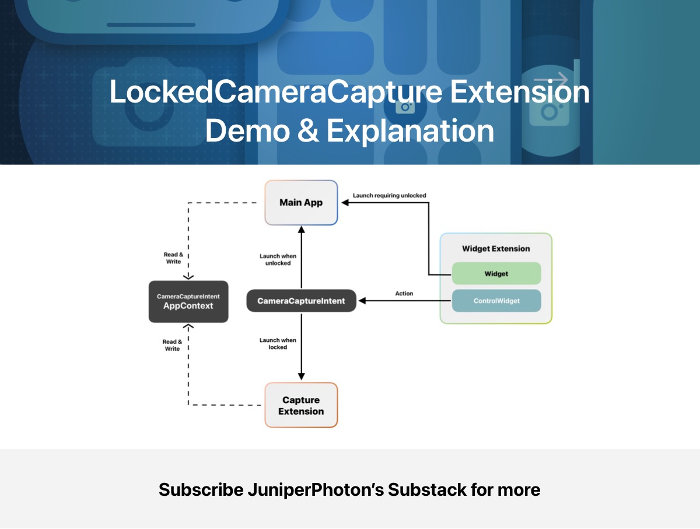
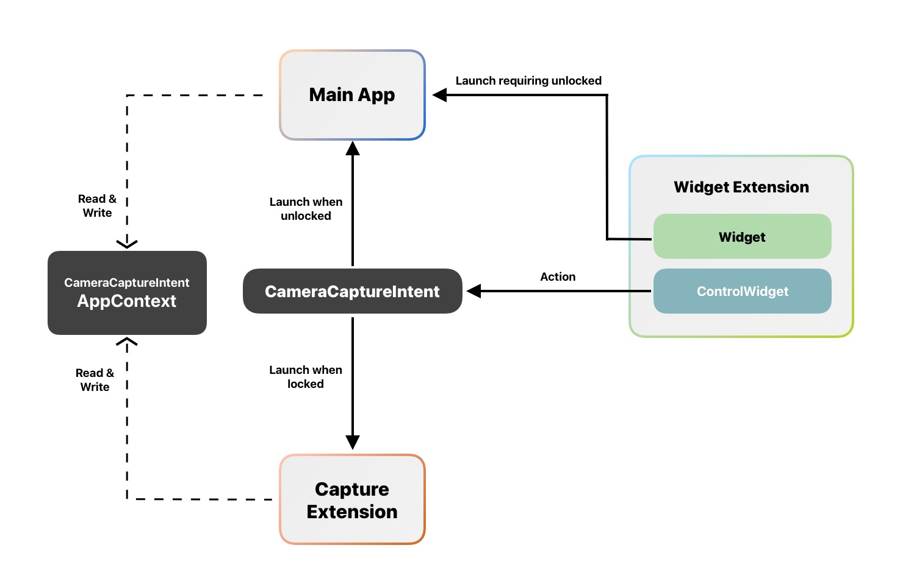
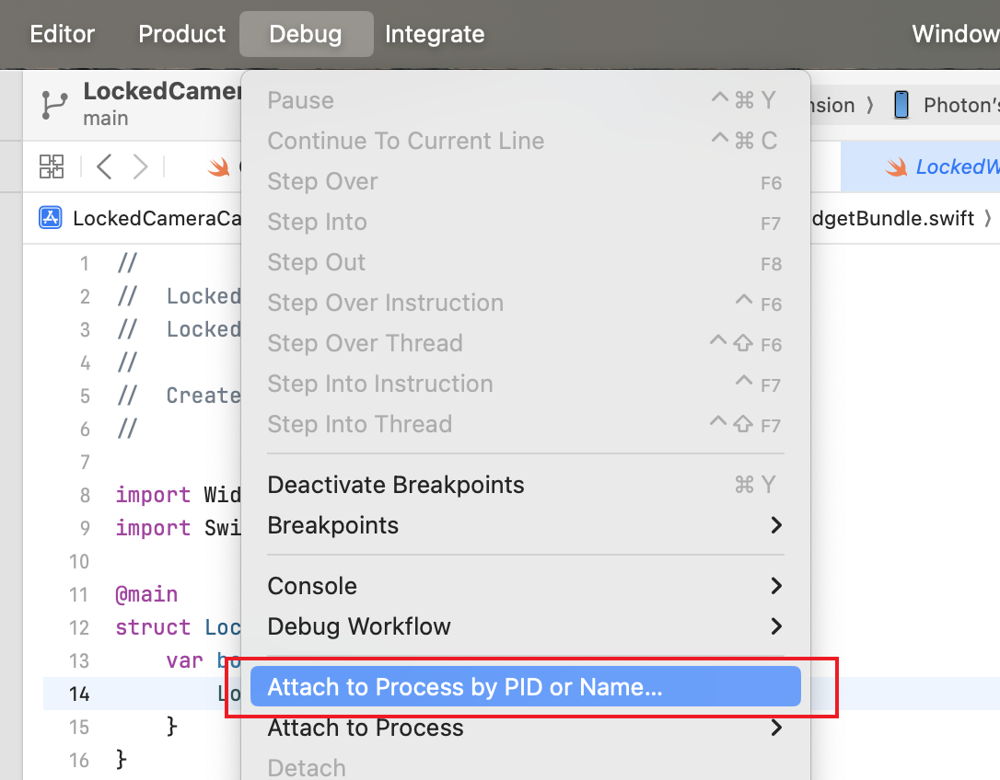
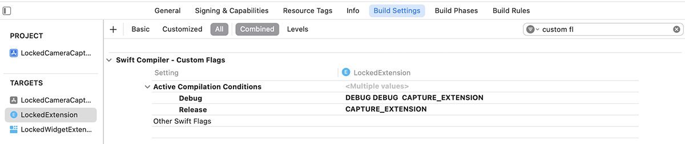

# LockedCameraCapture Extension Demo & Explanation



Starting from iOS 18, we can integrate the `LockedCameraCapture` framework to our apps and let users launch 3rd-party camera apps directly on the Lock Screen by either Lock Screen Control or the Action button without unlocking the iPhone.

Apple has provided documentation for this feature at the following link: [documentation](https://developer.apple.com/documentation/LockedCameraCapture/Creating-a-camera-experience-for-the-Lock-Screen). However, there is currently no official demo available, and there are some subtle details that developers should be aware of. 

Here we are. I created this demo while experimenting with the `LockedCameraCapture` framework and integrating it into my upcoming release of the [PhotonCam](https://apps.apple.com/us/app/photoncam-better-proraw-cam/id6470341051?l) app. It’s a ProRAW camera app that offers Pro-level control, extensive customization options like filters and frames, and a photo editing feature.

Before reading the detailed explanation below, you can also build and run the demo app first.

> Note that due to the issue of iOS 18 Beta, you may find that the Capture Extension in this demo may not launch from the lock screen. Try uninstalling the app and rebooting your device to solve this issue.

The following sections will talk about some key implementation details and I highly suggest you reading the Apple [documentation](https://developer.apple.com/documentation/LockedCameraCapture/Creating-a-camera-experience-for-the-Lock-Screen) first.

> You are welcome to subscribe my [Substack](https://juniperphoton.substack.com/p/lockedcameracapture-extension-demo) for free to view more articles.

## The anatomy of your app 

The app that implements the `LockedCameraCapture` feature should at least contain 3 different parts:

1. Your main app that will launch when users click the app icon on the home screen.
2. The Widget Extension provides Control Widget, which was introduced in iOS 18 to let users launch your app via Control Center or Lock Screen.
3. The Capture Extension that conforms to the `LockedCameraCaptureExtension` protocol and provides the entry point for your extension app.

Here is the illustration of the launching process:



The following sections talk about some key details that need to be aware of while implementing the Capture Extension.

## How to debug the Capture Extension

For a regular iOS app, when launching from Xcode, you don't worry about how the debugger is attached. If your app crashes during the launch, Xcode will guide you to the code where the crash happens.

In contrast, the automatic attaching process for the app extension is not enabled. If you launch your app from Xcode, the debugger will only be attached to the main app. Consequently, if your extension crashes during launch, it becomes challenging to identify the cause of the issue.

Xcode offers a mechanism to defer the attachment of the debugger to a process.



Access the Debug menu and locate the option “Attach to Process by PID or Name.” Subsequently, input the name of your Capture Extension. **By executing this action, even if the process you intend to debug is not currently running, Xcode will establish a connection with it upon its subsequent activation.**

If your Capture Extension is currently running, you can simply locate the Process under the “Attach to Process” submenu to debug your code.

## Prevent the extension from being killed

The Capture Extension, as its name suggests, is specifically designed for capturing purposes. Apple has implemented certain restrictions to ensure that the extension is solely intended for capturing functions, such as:

1. You should start your camera session while the extension is running.
2. Add `AVCaptureEventInteraction` to the view, which enables the hardware to detect pressing events.

If your Capture Extension doesn’t adhere to the limitations mentioned above, it will be terminated after approximately 10 seconds.

Please be aware that when the users click the Control Widget, iOS will determine whether to launch the main app or the Capture Extension based on the current conditions, like whether your device is locked or not.

> For testing purposes, you should lock your iPhone manually, turn your face around, and launch the app via the Action button or Control Widget on the Lock Screen.

### Implement `AVCaptureEventInteraction`

The `AVCaptureEventInteraction` is a subclass of `UIInteraction` introduced in iOS 17.2 as part of the UIKit framework.

> `UIInteraction`: The protocol that an interaction implements to access the view that owns it.

`UIView` has an instance method called `addInteraction(_:)` to add a specific `UIInteraction`. 

However, since Apple is transitioning to SwiftUI, and `LockedCameraCaptureUIScene` expects a SwiftUI view, it seems weird for Apple to offer such an API that can't be directly used in SwiftUI.

You might want to retrieve the `UIView` from the current `UIWindow`’s root `UIViewController`. However, for the iOS extension, there’s no way to access the current `UIScene` because `UIApplication.shared` isn’t available in the extension.

Therefore, we can add our custom `UIView` to the hierarchy of SwiftUI views, as shown below:

```swift
@available(iOS 17.2, *)
private struct CaptureInteractionView: UIViewRepresentable {
    var action: () -> Void
    
    func makeUIView(context: Context) -> some UIView {
        let uiView = UIView()
        let interaction = AVCaptureEventInteraction { event in
            if event.phase == .began {
                action()
            }
        }
        
        uiView.addInteraction(interaction)
        return uiView
    }
    
    func updateUIView(_ uiView: UIViewType, context: Context) {
        // ignored
    }
}
```

We can also implement an extension method for the `View` class to handle interaction events.

```swift
extension View {
    @ViewBuilder
    func onPressCapture(action: @escaping () -> Void) -> some View {
        if #available(iOS 17.2, *) {
            self.background {
                CaptureInteractionView(action: action)
            }
        } else {
            self
        }
    }
}
```

Then you can use the `onPressCapture(action:)` on your root view:

```swift
YourView {
    // content
}.onPressCapture {
    Task {
        await viewModel.capturePhoto()
    }
}
```

## Code sharing between main app & Capture Extension

To share code or assets between your main app and the Capture Extension, you can mark your code files as belonging to the Targets.

When you add a file to your Xcode project, you can specify which targets should include that file. The “Target Membership” section in the File Inspector (on the right pane of Xcode) presents a checklist of all the targets in your project. You can check or uncheck targets to control whether the file is compiled into the corresponding products.

Note that compiling all the files from the main app to the Capture Extension will result in a larger compiled bundle size. Consequently, users will require more time and data to download your app from the App Store.

Also, not all the code you write in the main app can be compiled for the Capture Extension. For instance, the `UIApplication.shared` API is unavailable for all types of extensions. Therefore, if you rely on `UIApplication.shared` to obtain `UIScene`, `UIWindow`, `UIApplication.shared.alternateIconName`, or other related instances, you should consider using those methods to handle this situation.

1. Avoid using `UIApplication.shared` and explore alternative methods to obtain the desired functionality.
2. Ensure that the code using `UIApplication.shared` is included in the main app target and provide a stub version of it that is included in the Capture Extension target.
3. Add a Swift custom flag to the build settings for your extension target and use the `#if` directive to conditionally compile code.



> Note that your Capture Extension should prioritize providing a seamless capture experience for users. Additionally, you should prompt users to open the main app when they are accessing unrelated features. 

## Scene Phase handling

In the Capture Extension, it is safe to assume that the `ScenePhase` environment variable is always active. However, when retrieving its value from `EnvironmentValues`, its value will always be `.background`. Any logic relied on this value, for example, you might want to perform some tasks when the scene is in foreground, will be invalid.

To address this issue, you don’t need to modify each component of your logic. Instead, you can simply introduce your own `ScenePhase` to the root view. However, if you’re not utilizing SwiftUI’s lifecycle, you’ll need to create your own version of `ScenePhase` and inject it into your code.

```swift
struct LockedCameraCaptureView: View {    
    var body: some View {
        ContentView()
            .environment(\.scenePhase, .active)
    }
}
```

## Data sharing between the main app and the Capture Extension. 

The challenging aspect of implementing the `LockedCameraCapture` extension is its distinction from other iOS extensions, such as the widget extension, and other extensions in general. Unlike these extensions, which can share `UserDefaults` and files through the `AppGroup` mechanism, the `LockedCameraCapture` extension lacks this capability due to the privacy concern.

For Capture Extension, the only way to share your configurations is via the `CameraCaptureIntent.appContext` API or the `LockedCameraCaptureManager` to access the directories containing captured content.

### Share your configurations

Consider the code below:

```swift
struct SwitchCameraButton: View {
    @AppStorage("UseFrontCamera")
    private var useFrontCamera: Bool = false
    
    var body: some View {
        Button {
            useFrontCamera.toggle()
        } label: {
            // label
        }
    }
}
```

You might have relied on SwiftUI’s `AppStorage` property wrapper and `UserDefaults` to store the configurations of your UI, such as the camera position, user-selected zooming scale, or the ProRAW switch. However, since the Capture Extension can’t access or modify the shared `UserDefaults`, the state wrapped with `AppStorage` won’t function as intended.

If your app’s minimum target version is iOS 18, you can fully utilize the `CameraCaptureIntent.appContext` to store configurations that should be shared across the main app and the Capture Extension. However, there’s a size limitation of 4 KB for `appContext`. For better compatibility, you still need to store the configurations in both `UserDefaults` and `CameraCaptureIntent.appContext`.

- When the value of your switch changes, it must be written to both `UserDefaults` and `CameraCaptureIntent.appContext` for the main app. However, it should avoid writing to `UserDefaults` in the Capture Extension.
- You can't use the `AppStorage` property wrapper to let SwiftUI automatically update your view. You should declare the configurations in your view model, and when the values are updated, invoke `objectWillChange.send()` to trigger UI update.
- The initial value of your configuration should be read in the order of `CameraCaptureIntent.appContext`, `UserDefaults`, and a fallback value.

Here’s an example of code to read configurations from the `appContext` and `UserDefaults`.

```swift
@MainActor
func updateFromAppContext() async {
#if !CAPTURE_EXTENSION
    // If it's in the main app, first read the value from the UserDefaults.
    self.cameraPosition = AppUserDefaultSettings.shared.cameraPosition
#endif
        
    if #available(iOS 18, *) {
        do {
            // If `AppCaptureIntent.appContext` exists, then read from it.
            if let appContext = try await AppCaptureIntent.appContext {
                self.cameraPosition = appContext.cameraPosition
            }
        } catch {
            print("error on getting app context")
        }
    }
}
```

### Share files

Technically, the main app and the Capture Extension can't share files since what `LockedCameraCaptureManager` has provided is a one-way method: You use `LockedCameraCaptureManager` in your main app to listen for the updates of session contents, and you can then invalidate the URLs after processing them properly.

```swift
for await update in LockedCameraCaptureManager.shared.sessionContentUpdates {
    switch update {
    case .initial(let urls):
        // Process captured content from existing session content directories.
        break
    case .added(let url):
        // Process captured content from a new session content directory.
        break
    case .removed(let url):
        // Process captured content from a removed session content directory.
        break
    default:
        // An unknown sessionContentUpdate was received.
        break
    }
}
```

> For some unknown reasons, no updates will be emited when I test this API in Xcode 16 Beta 6 with iOS 18 Beta 7. I have fired the issue to Apple via the Feedback app.

For the files created in your main app, even those under the `AppGroup`, the Capture Extension doesn’t have access to them. This includes the SQLite files used by SwiftData or Core Data. If you’re using SwiftData or Core Data to store user data, you’ll need to provide an in-memory database and disable any features that require writing to the database. 

For my PhotonCam app, I store users’ customized filters, aspect ratios, and frames using Core Data. While in the Capture Extension, I’ll provide default presets of these features for users to use.

## Store temporary files in the Capture Extension

You could have used those methods below to obtain the root directory and then append the path and names to create a file URL for storing the file.

```swift
func getRootURL() -> URL? {
    try? FileManager.default.url(
        for: .documentDirectory,
        in: .userDomainMask,
        appropriateFor: nil,
        create: true
    )
    
    // Or URL.documentsDirectory
}

func getSharedRootURL() -> URL? {
    try? FileManager.default.containerURL(
        forSecurityApplicationGroupIdentifier: "com.juniperphoton.appgroup"
    )
}
```

In the Capture Extension, the URL we got here is not accessible. Actually, the `LockedCameraCaptureSession` provided in the `LockedCameraCaptureUIScene` has a `sessionContentURL` property for us to use as the root URL.

Here is a machanism to help you setup the correct rootURL in the entry point of your app, and read it throughout the rest of your app.

You can declare a `AppStorageConfigProvider` that provides the rootURL and a `standard` shared instance for the main app to use.

```swift
struct AppStorageConfigProvider {
    let rootURL: URL?
}

extension AppStorageConfigProvider {
    static let standard = AppStorageConfigProvider(
        rootURL: getStandardRootURL()
    )
}
```

To help creating an instance of `AppStorageConfigProvider` from `LockedCameraCaptureSession`, you can have another initializer that takes `LockedCameraCaptureSession`:

```swift
@available(iOS 18, *)
extension AppStorageConfigProvider {
    init(_ session: LockedCameraCaptureSession) {
        self.rootURL = session.sessionContentURL
    }
}
```

In your main app's entry:

```swift
@main
struct LockedCameraCaptureExtensionDemoApp: App {
    var body: some Scene {
        WindowGroup {
            ContentView(configProvider: AppStorageConfigProvider.standard)
        }
    }
}
```

In your Capture Extension:

```swift
@main
struct LockedExtension: LockedCameraCaptureExtension {
    var body: some LockedCameraCaptureExtensionScene {
        LockedCameraCaptureUIScene { session in
            LockedCameraCaptureView(session: session)
        }
    }
}

struct LockedCameraCaptureView: View {
    let session: LockedCameraCaptureSession
    
    var body: some View {
        ContentView(configProvider: AppStorageConfigProvider(session))
    }
}
```

Well, there are numerous other ways to inject the `AppStorageConfigProvider` into the rest of your application, such as using SwiftUI’s `EnvironmentObject`, `EnvironmentValues`, or other Dependencies Injection frameworks. Dependencies management is crucial when building a robust app, and it won’t be discussed further in this section.
